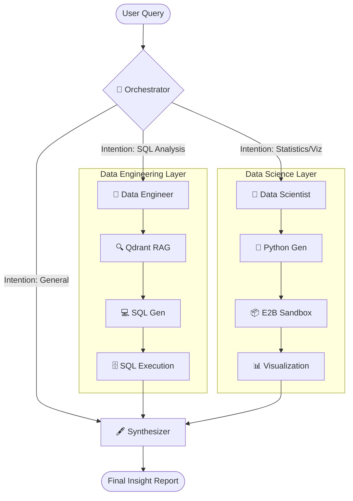

# 🔍 Insights Aegra: Multi-Agent Data Intelligence Platform

[](https://github.com/accely-eerly-ai/insights_aegra)
[](https://nextjs.org/)
[](https://www.postgresql.org/)
[](LICENSE)

Insights Aegra is a **production-ready Multi-Agent Data Intelligence system** built on the [Aegra Framework](https://github.com/accely-eerly-ai/insights_aegra). It enables high-accuracy data analysis through a sophisticated autonomous multi-agent graph, combining RAG-driven SQL generation with sandboxed Python code execution.

---

## 🏛️ System Architecture

Insights Aegra operates on a **high-concurrency state graph** powered by LangGraph. Every user query is automatically de-contextualized and routed through specialized intelligence nodes.



---

## 🤖 Specialized Agent Roles

| Agent | Core Responsibility | Intelligence Stack |
| :--- | :--- | :--- |
| **🧠 Orchestrator** | Intent classification & routing logic | Mistral/Gemini + Context Window Mgmt |
| **👷 Data Engineer** | Schema-aware SQL generation & retrieval | Qdrant + PostgreSQL + RAG |
| **🔬 Data Scientist** | Statistical analysis & data visualization | E2B Sandbox + Pandas + Matplotlib |
| **🖋️ Synthesizer** | Multi-agent output merging & reporting | Structured LLM Reporting |

---

## 🔥 Key Features

- **✅ Autonomous Intent Routing**: Intelligently decides between direct SQL querying or deep Python-based statistical analysis.
- **✅ Postgres-Backed Memory**: Full multi-turn conversation persistence using high-performance PostgreSQL checkpointing.
- **✅ RAG-Driven Engineering**: Utilizes Qdrant vector store for high-accuracy schema and business logic retrieval.
- **✅ Sandboxed Code Execution**: Executes data science code in isolated E2B environments for maximum security and reliability.
- **✅ Professional Chat UI**: A premium Next.js 15+ frontend with real-time streaming and interactive chart rendering.

---

## 🛠️ Technology Stack

- **Backend**: Python 3.12, FastAPI, Aegra (Agent Protocol Server).
- **Orchestration**: LangGraph, LangChain.
- **Persistence**: PostgreSQL (SQLAlchemy + LangGraph Checkpoints).
- **Vector Search**: Qdrant.
- **Sandbox**: E2B SDK.
- **Frontend**: Next.js 15, Tailwind CSS (OKLCH), Radix UI, Lucide Icons.

---

## 🚀 Installation & Local Development

### Prerequisites
- **Python 3.12** or higher
- **Node.js 18** (pnpm recommended)
- **Docker** (for Postgres/Qdrant/E2B dependencies)

### 1. Repository Setup
```bash
git clone https://github.com/accely-eerly-ai/insights_aegra.git
cd insights_aegra
uv sync --all-packages
```

### 2. Environment Configuration
Copy the default environment template and fill in your API keys (Azure/Mistral, Qdrant, E2B):
```bash
cp .env.example .env
```

### 3. Start Backend Services
```bash
# Start Aegra server (Auto-migrations enabled)
uv run aegra dev
```

### 4. Start Fronted Interface (Insights Portal)
```bash
cd agent-chat-ui-main
pnpm install
pnpm dev
```
The Insights Portal will be available at `http://localhost:3000`.

---

## 📖 Documentation

For deep dives into specific components, please refer to the following documentation:

- [📄 Architecture Overview](docs/overview.md)
- [📄 Configuration Guide](docs/configuration.md)
- [📄 Custom Agent Integration](docs/custom_agents.md)
- [📄 Authentication & Security](docs/authentication.md)

---
*Powered by Aegra — The Professional Self-Hosted Agent Protocol Framework.*
